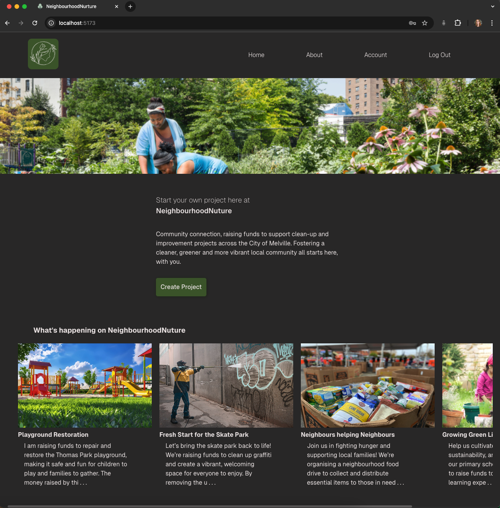
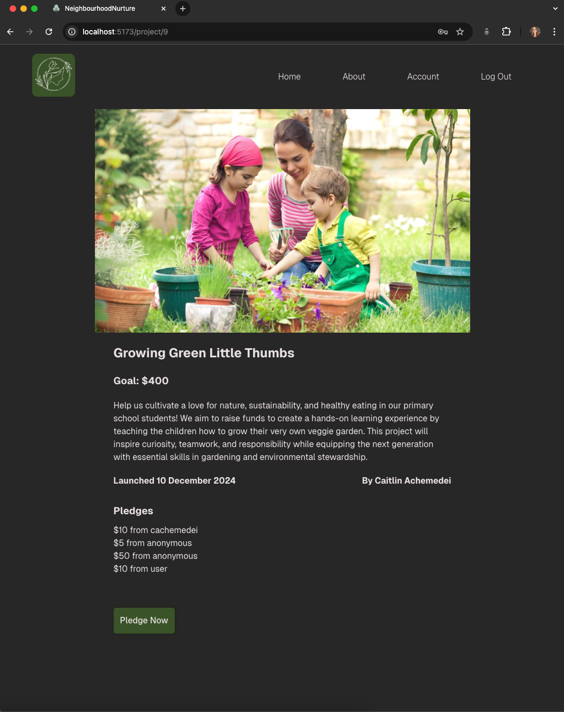
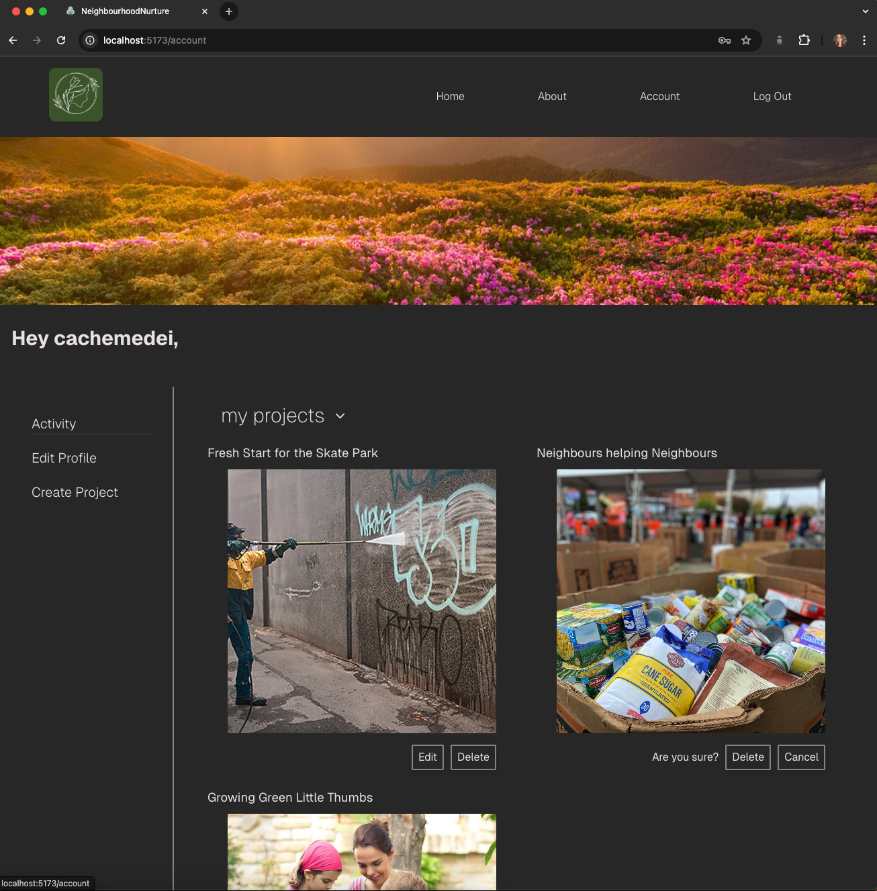
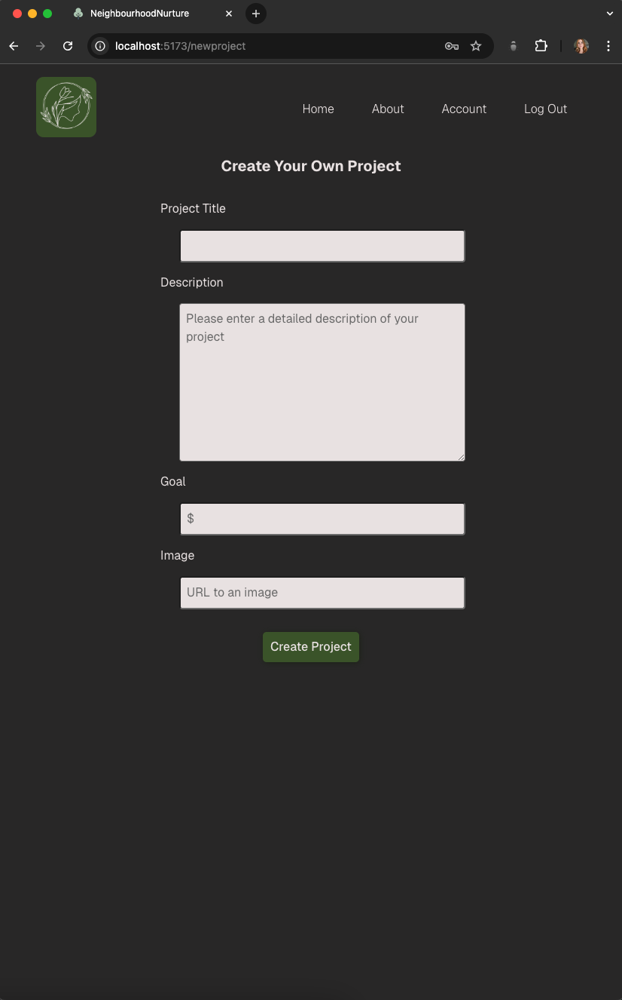
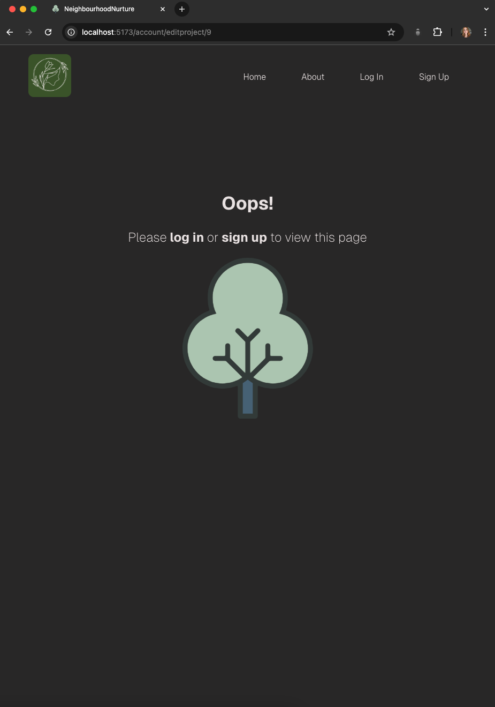
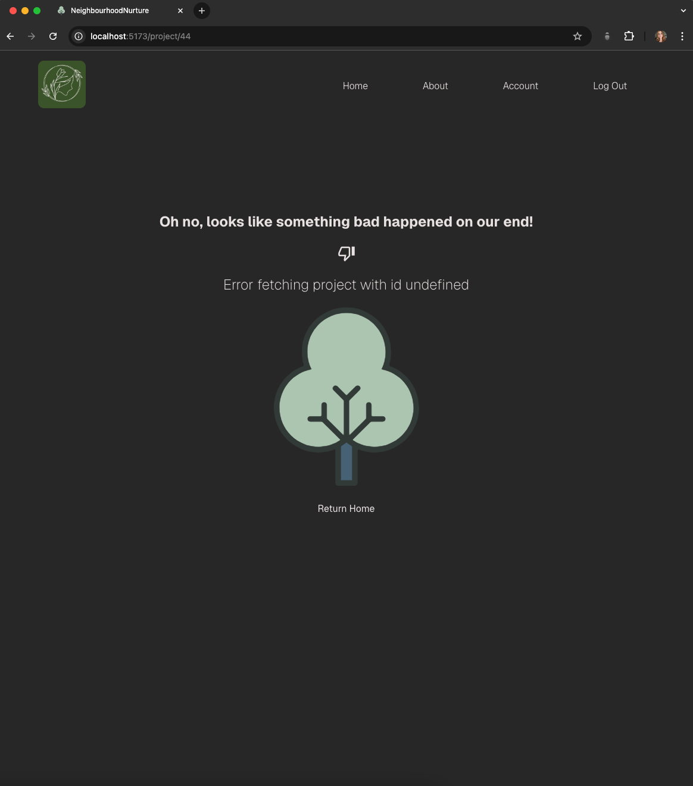

# NeighbourhoodNurture

### A full stack crowdfunding web application created using Django + Django Rest Framework for the backend and React JS for the frontend

### Deployed Site:
https://neighbourhoodnurture.netlify.app/

## Functionality

- Users can create an account with the following attributes:
    - First name
    - Last name
    - Email
    - Username
    - Password
- Once signed up and logged in, a user can then edit their account details

- Users can create projects with the following attributes
  - Title
  - Owner (a user)
  - Description
  - Image
  - Target amount to fundraise
  - When the project was created

- Users have the ability to “pledge” to a project with the following attributes
  - An amount
  - The project the pledge is for
  - The supporter/user (i.e. who created the pledge)
  - Whether the pledge is anonymous or not
  - A comment to go along with the pledge
  - A user must be logged in to pledge to a project

- To delete or edit a project, a user must be logged in and the owner of that project

- A Not Found page is returned to handle failed requests

## Screenshots

### Homepage

### Project Page

### Account Page

### Create Project Form

### Error - No access

### Error - Failed request

